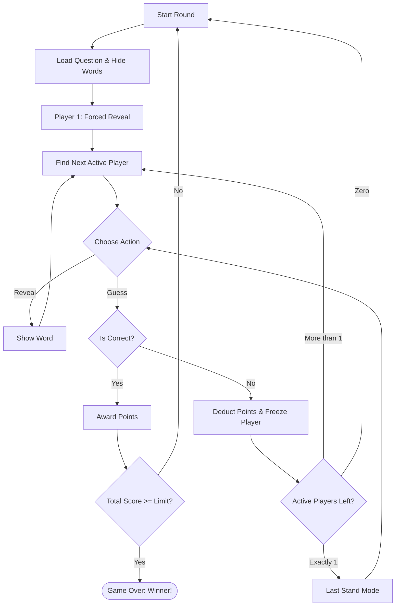

The game is 2 or more players, a 'party' style game where the more the merrier. 

The players are presented a board showing a question where each word is hidden. 
- Each turn a player can choose to reveal a word or try to answer the question. 
- If the player chooses to reveal the word is unhidden in the sentence and play passes to the next player. 
- If the next player chooses to answer they say the answer and then they alone revel the answer. 
- If the answer matches they win the points and the game resets for the next round. 
- If they are incorrect they loose points and are frozen out for the rest of the round. the remaining players continue. 
- The last remaining player can take a free guess (or if words are still hidden they could reveal another word *but* if they answer incorrectly they will lose points as 'normal').

